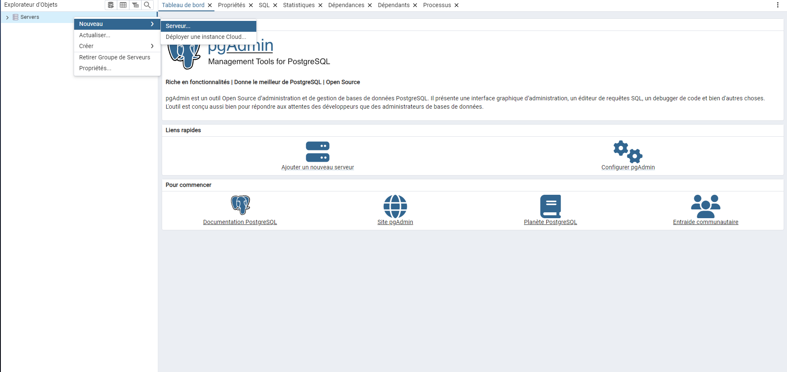
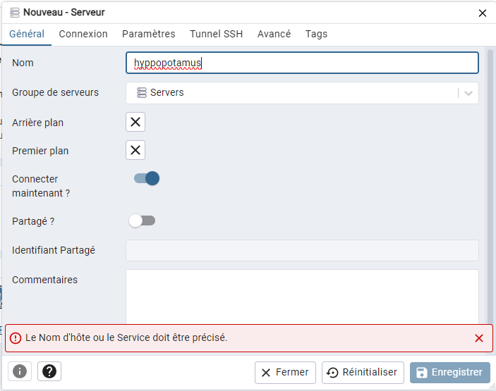
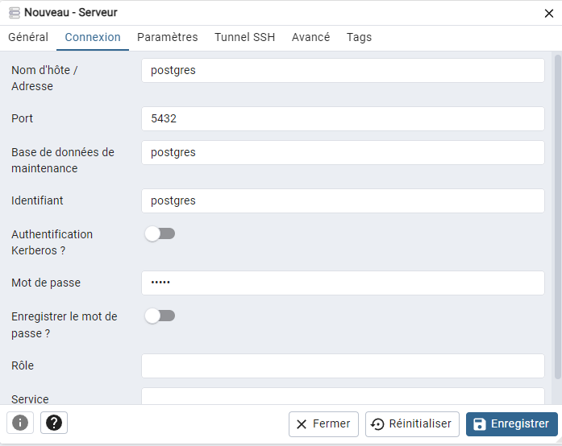

# Hackaton

## Getting started

### environnement de travail

recuipérer le code:
https

```sh
git clone https://github.com/Eric-Philippe/Hackaton_Hippo.git
```

ssh

```sh
git clone git@github.com:Eric-Philippe/Hackaton_Hippo.git
```

Demmarer docker compose

```sh
docker-compose up
```

###PG admin
####se connecter:
→ Lorsque les contenneuirs DOcker sont démmarés, PG admin est accéssible sur l'adresse du serveur au port 5050 (ou un autre port défini dans le .env):
par exemple localhost:5050
→ Une fois sur PGAdmin se connecter avec les indentifiants définis dans le .env
Mail: postgres@example.com
mot de passe admin
####Acceder à la BDD après la première connection
clic droit sur serveur→nouveau→server

Mettre le nom de votre choix:

aller sur la section Connexion et entrer les informations définies dans le .env:

(Le mot bde passe est celui de pg_pass)

Vous avez désormais accès à la BDD

Votre configuration sera enregistrée dans le volume Docker ainsi vous pourrais la retrouver a chaque connection.
