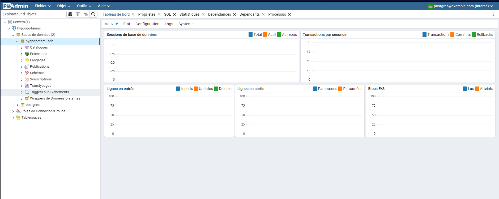

# Hackaton

## Getting started

### environnement de travail
recuipérer le code:
ovrir un terminal et lancer une des deux requêtes:
si vous avez une clefs SSH:
    ssh

    ```sh
    git clone git@github.com:Eric-Philippe/Hackaton_Hippo.git
    ```
sinon:
    https
    ```sh
    git clone https://github.com/Eric-Philippe/Hackaton_Hippo.git
    ```

Installer docker → https://docs.docker.com/get-docker/
Demmarer l'application docker compose
```sh
docker-compose up
```
variables d'environnement à mettre dans le fichier .env à la racine du projet (si il n'y est pas déja:

→Postgres:
PG_USER='postgres'
PG_PASS='admin'
PG_HOST='postgres'
PG_DB='hyppopotamusdb'
PG_PORT=5432
PG_ADMIN_PORT=5050
PGADMIN_DEFAULT_EMAIL='postgres@example.com'
PGADMIN_DEFAULT_PASSWORD='admin'

→ Api:
EMAIL_FROM='hyppopotamus.com'
EMAIL_USER='user'
EMAIL_PASS='password'
API_PORT=8001
API_ADDRESS='localhost'
JWT_SECRET='secret'
JWT_EXPIRES_IN='1d'
BYPASS_AUTH=true

→Front:
FRONT_PORT='80'

### PG admin
#### se connecter:
→ Lorsque les contenneuirs DOcker sont démmarés, PG admin est accéssible sur l'adresse du serveur au port 5050 (ou un autre port défini dans le .env):
par exemple localhost:5050
→ Une fois sur PGAdmin se connecter avec les indentifiants définis dans le .env
Mail: postgres@example.com
mot de passe admin
####Acceder à la BDD après la première connection
clic droit sur serveur→nouveau→server

Mettre le nom de votre choix:

aller sur la section Connexion et entrer les informations définies dans le .env:

(Le mot bde passe est celui de pg_pass)

Vous avez désormais accès à la BDD

Votre configuration sera enregistrée dans le volume Docker ainsi vous pourrais la retrouver a chaque connection.
